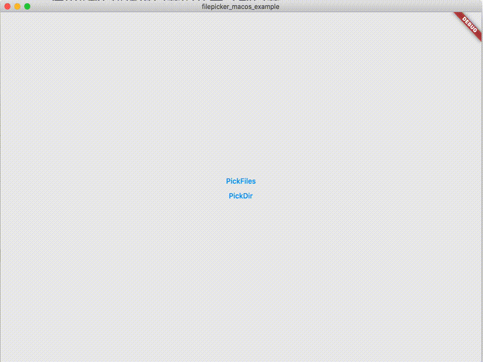

# filepicker_macos

filepicker_macos

## Getting Started



```dart
import 'package:flutter/material.dart';

import 'package:filepicker_macos/filepicker_macos.dart';

void main() {
  runApp(const MyApp());
}

class MyApp extends StatelessWidget {
  const MyApp({Key? key}) : super(key: key);

  @override
  Widget build(BuildContext context) {
    return MaterialApp(
      home: Container(
        alignment: Alignment.center,
        child: Column(
          mainAxisSize: MainAxisSize.min,
          children: const [
            TextButton(
              onPressed: FilepickerMacos.pickFile,
              child: Text("PickFiles"),
            ),
            TextButton(
              onPressed: FilepickerMacos.pickDir,
              child: Text("PickDir"),
            ),
          ],
        ),
      ),
    );
  }
}

```
